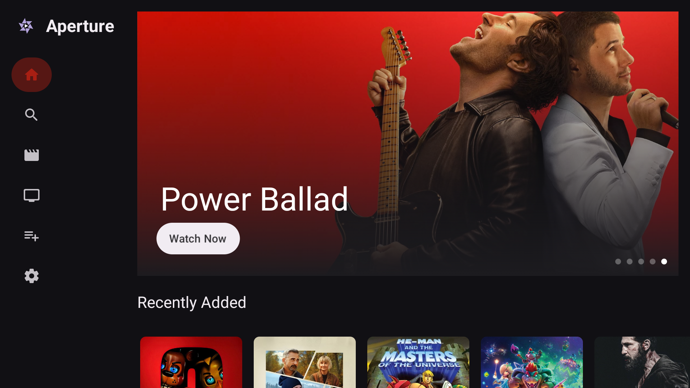
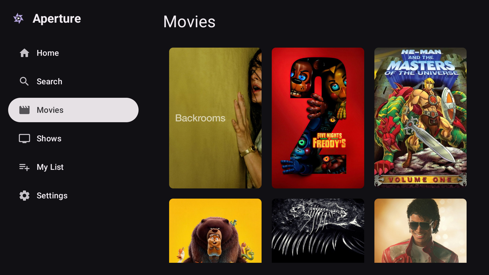
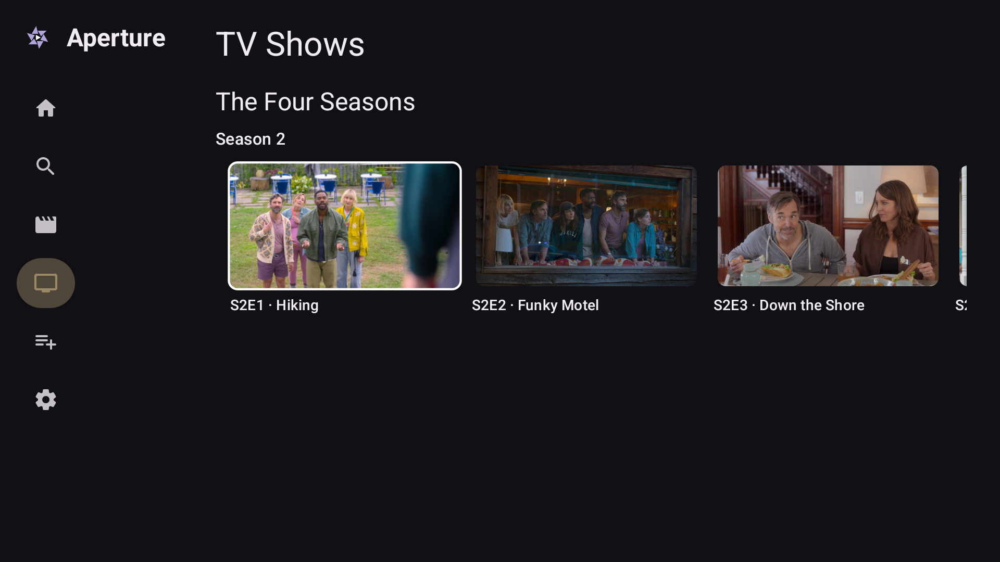
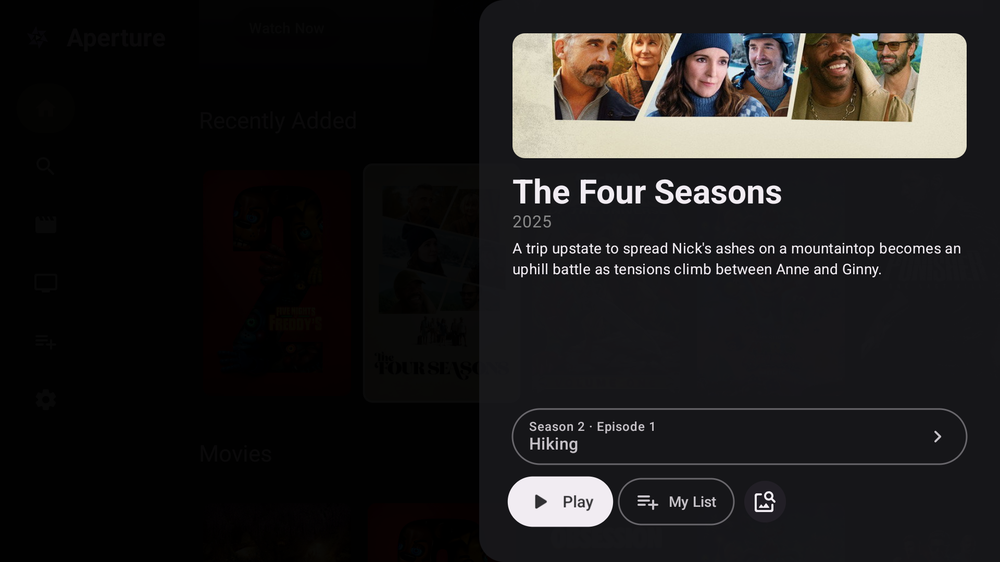
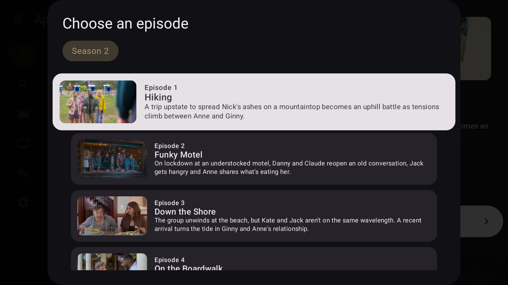
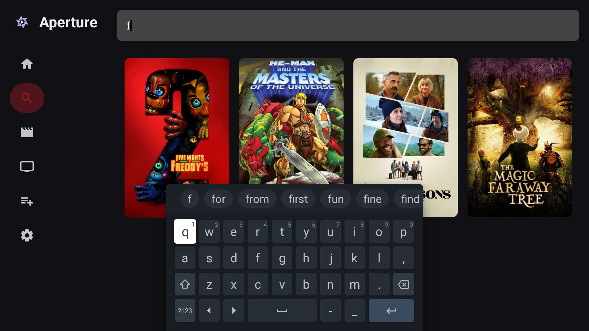
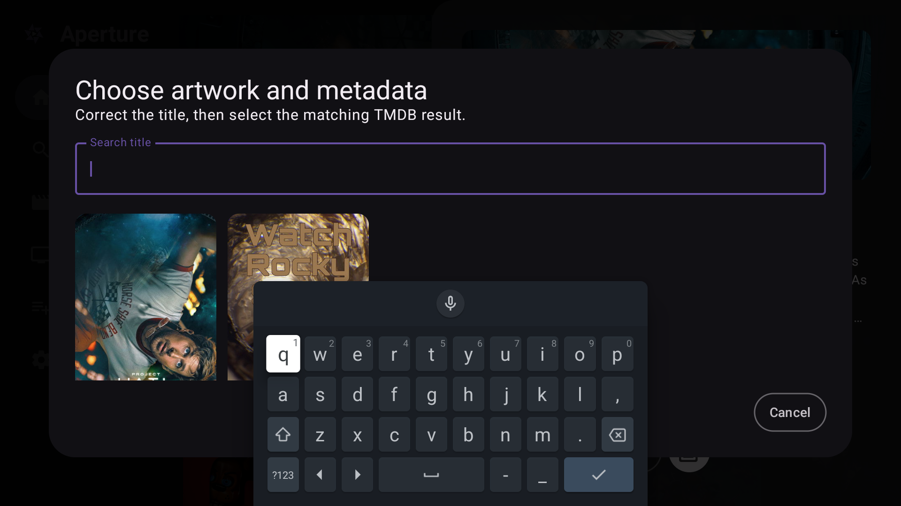

<p align="center">
  
</p>

<h1 align="center">Aperture</h1>

<p align="center">
  <i>Finally, a Material 3 media player for Android TV!</i>
</p>

<p align="center">
  <a href="https://xdan.me/aperture">Website</a> •
  <a href="https://github.com/XDanfr/Aperture/releases/latest">Download the latest alpha</a> •
  <a href="https://discord.gg/vne5ED9xsm">Discord Server
</p>

---

## What you'll need
* Your own library of local media under `Movies` and `TV Shows` directories in local or extended storage (`Download`, `DCIM` and `Videos` are also supported.)
* Clear file names representing movie titles
* Clear folder structure (e.g. `Show/Season/SXXEXX.mp4`) for TV Shows

## 📸 Screenshots

<p align="center">
  
</p>

<p align="center">
  
  
</p>

<p align="center">
  
  
</p>

<p align="center">
  
  
</p>

## ✨ Features

* **Material 3 UI**
* **TV-Optimised Navigation**
* **Media3 Powered**
* **Custom themes**
* **Name matching and asset detecting with TMDb**

## 🗺️ Roadmap

Aperture is currently in **ALPHA**. Here is what is being tracked for future incremental updates:

### Planned Features

- [X] **Popup Animations**: Smooth entrance/exit transitions for the media details modal
- [X] **Progress Indicators**
- [X] **My List**
- [X] **Hold-for-actions Context Menu** (https://github.com/XDanfr/Aperture/issues/1)
- [X] **Movies and TV Shows sorted separately**
- [X] **TV Show Season and Episode grouping**
- [X] **Dynamic Theming**: based on active media artwork
- [X] **Custom Themes**
- [ ] **Optionally selecting Assets manually**
- [X] **Update Checking**
- [ ] **Press Back for Sidebar Navigation**
- [X] **Proper Show and Episode Detection**: Support for more file names and types. Always improving.
- [ ] **Better Movie Detection**: Improve TMDb matching for sequels, years and similarly named films.
- [X] **Manual Title Correction**: This also updates assets accordingly.
- [ ] **Rounded Spotlight**
- [ ] **OpenSubtitles Support**
- [ ] **Support for more codecs**

## 🚀 Getting Started

### Quick Install (Recommended)

Download the latest release `.apk` directly from the [Releases](https://github.com/XDanfr/Aperture/releases/latest) tab and sideload it onto your Android TV device. We recommend using [Downloader by AFTVNews](https://play.google.com/store/apps/details?id=com.esaba.downloader) from the Google Play Store.

### Or: Build From Source

1. **Clone the repository:**

   ```bash
   git clone https://github.com/XDanfr/Aperture.git
   ```

2. **Open in Android Studio:** Ensure your environment is configured to use **JDK 17 or 21** (others are currently untested).
3. **Sync & Deploy:** Sync Gradle, build the project, and deploy it to your physical Android TV device or an emulator running **API 27+**.

## 🛠️ Tech Stack

* **Language:** [Kotlin](https://kotlinlang.org/)
* **UI Framework:** [Jetpack Compose for TV](https://developer.android.com/training/tv/playback/compose)
* **Media Engine:** [Media3 / ExoPlayer](https://developer.android.com/media/media3)
* **Theming:** Material 3
* **Website Components:** [matraic/m3e](https://github.com/matraic/m3e)

## 🤝 Contributing

Contributions are what make the open-source community such an amazing place! Want a feature or a bugfix? Pull requests are incredibly welcome.

* **Issues:** Open an issue if you discover a new bug or want to propose a fresh feature request.
* **Pull Requests:** Fork the project, create your branch, and submit a PR. Please make sure that your code aligns with the existing project style, unless you're going for a more M3E style as Material 3 transitions towards that look.

## 💬 FAQ

**Q: How are mass local drives parsed?**

**A:** The media architecture leverages standard Android Storage Access Framework processes to securely look up file spaces on attached storage hardware or local nodes.

**Q: Was any AI used for this?**

**A:** Gemini was used as a starter to build the baseline template. Some AI features (like autocomplete) were used to speed up development. However, all code is human-reviewed, manually structured, and the trickier bugs are tackled by hand!

---

<p align="center"><sub>If you like Aperture, please consider <a href="https://github.com/sponsors/XDanfr">supporting its development on GitHub Sponsors</a> 💜</sub></p>

