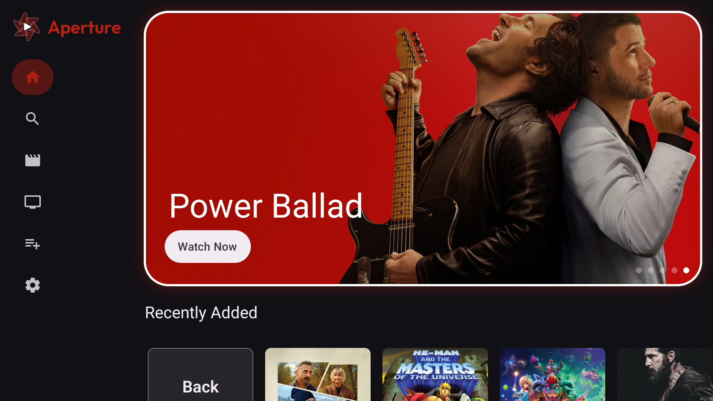
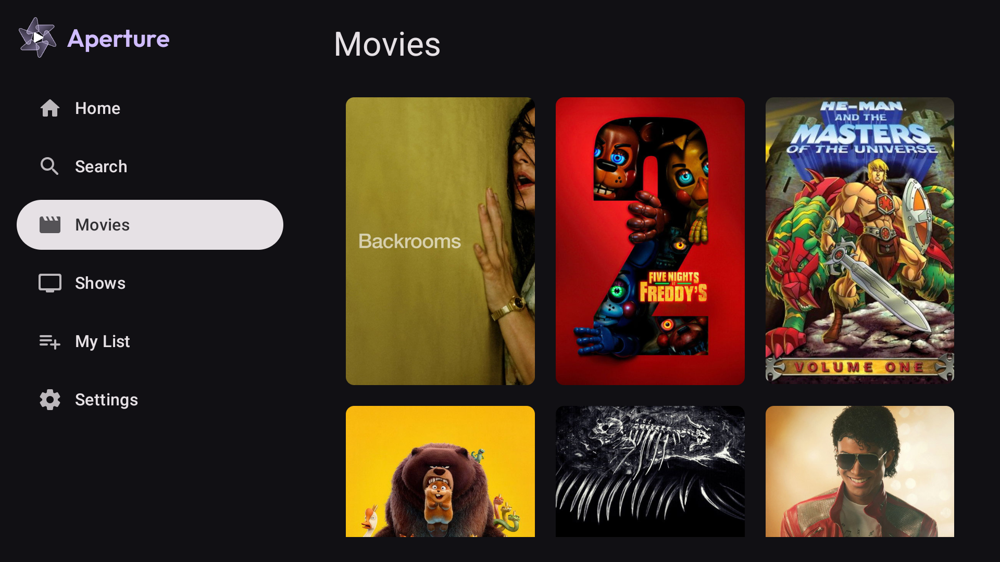
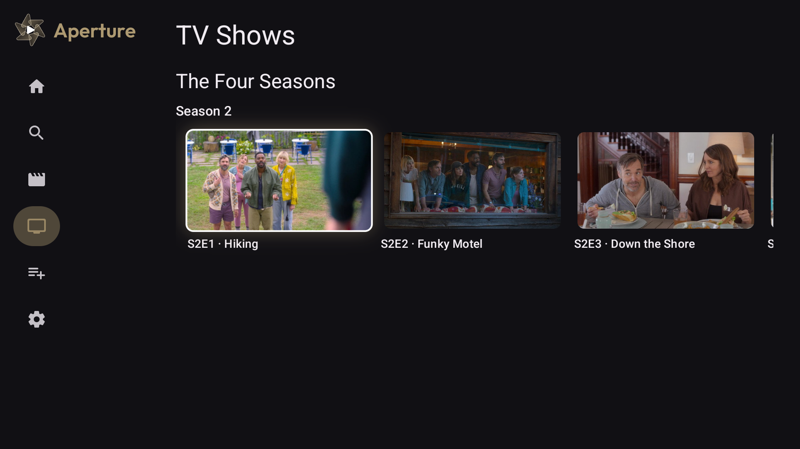
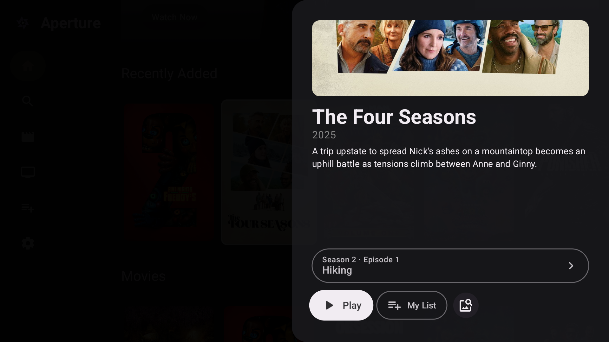
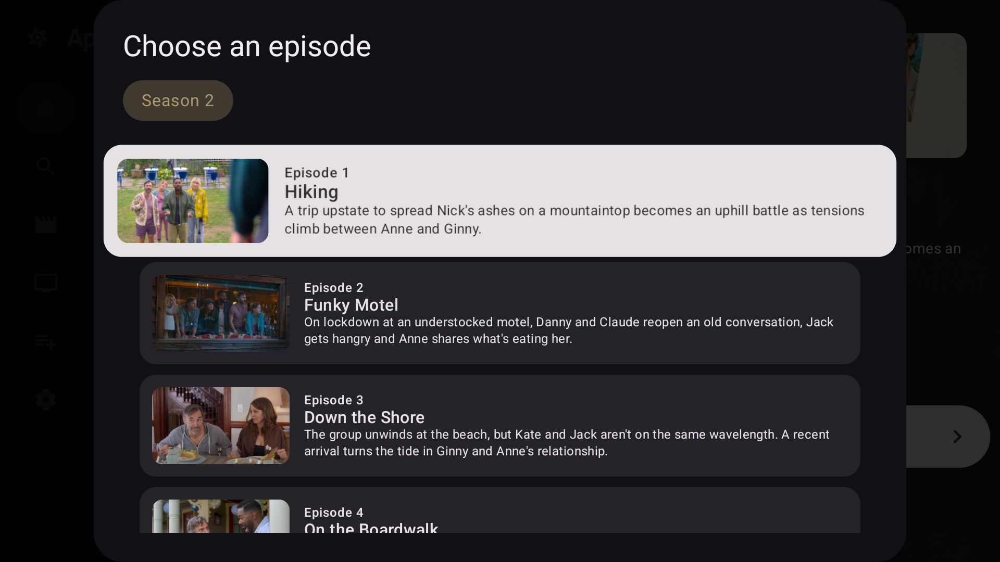
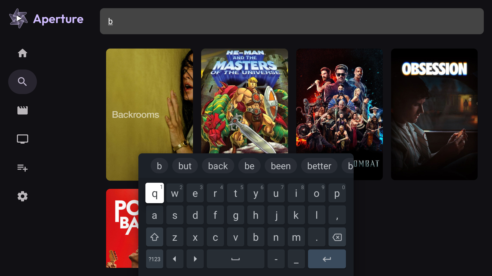
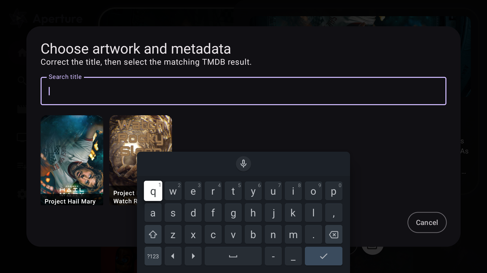

<p align="center">
  
</p>

<h1 align="center">Aperture</h1>

<p align="center">
  <i>Finally, a Material 3 media player for Android TV!</i>
</p>

<div align="center">

[](https://github.com/sponsors/XDanfr)
[](https://xdan.cc/aperture)
[](https://discord.gg/fuxMAVBccK)

[](https://github.com/XDanfr/Aperture/releases/latest)
[](https://github.com/XDanfr/Aperture/releases)

</div>

---

<p align="center">
  
</p>

## ✨ Features

* 🎨 **Customisable Material 3 UI**
* ⚡ **Media3 Powered**
* 🖼️ **Name matching and asset detecting with TMDb**

## 🚀 Getting Started

> [!IMPORTANT]
> * Organise your media under `Movies/` and `TV Shows/` folders in local or extended storage (`Download`, `DCIM` and `Videos` are also supported).
> * Use clean file names and standard TV structures (e.g. `Show Title/Season XX/SXXEXX.mp4`).

### Quick Install (Recommended)

Download the latest release `.apk` directly from the [Releases](https://github.com/XDanfr/Aperture/releases/latest) tab and sideload it onto your Android TV device.
> [!TIP]
> We recommend using [Downloader by AFTVNews](https://play.google.com/store/apps/details?id=com.esaba.downloader) from the Google Play Store or the [Amazon Appstore](https://www.amazon.com/dp/B01N0BP507/?tag=aftvn-20).

### Or: Build From Source

1. **Clone the repository:**

   ```bash
   git clone https://github.com/XDanfr/Aperture.git
   ```

2. **Open in Android Studio:** Ensure your environment is configured to use **JDK 17 or 21** (others are currently untested).
3. **Add API Keys:** local.properties needs a `TMDB_API_KEY` and an `OPENSUBTITLES_API_KEY` to function properly.
4. **Sync & Deploy:** Sync Gradle, build the project, and deploy it to your physical Android TV device or an emulator running **API 27+**.
> [!NOTE]
> The repo is undergoing a pretty large rework on the front end to adopt **Material 3 Expressive**, and the back end is adopting more codec support. The latest commits may have some bugs.

## 📸 Screenshots

<p align="center">
  
  
</p>

<p align="center">
  
  
</p>

<p align="center">
  
  
</p>

## 🗺️ Roadmap

Aperture is currently in **ALPHA**. Here is what is being tracked for future incremental updates:

### Planned Features

- [X] **Transition to Material 3 Expressive**: Very large rewrite planned for v0.5, using official Expressive tokens (this is complete and will arrive in the next update)
- [X] **Complete OpenSubtitles Integration**: (Complete in v0.5)
- [ ] **Proper audio synchronisation**: Forwards and backwards
- [ ] **Default audio track selection**: accessible in settings

### Playback and TV interaction

- [X] **Keep the sidebar closed behind playback menus**: Returning from playback and closing a play menu should preserve the selected item without opening the sidebar in the background.
- [X] **Spotlight show continuation**: Open the current or next episode with the season and episode selector, matching Continue Watching.
- [X] **Show continuation throughout the library**: My List, Search, TV Shows and other grouped show cards should open the current or next episode. Rewatching an earlier episode becomes the latest priority and continues from there.
- [ ] **Next episode popup**: In the final 10 seconds of an episode, show a focused preview card with the next episode's season, number, title and existing episode thumbnail, plus a “Playing in X” countdown. Selecting the card plays it immediately. An X below dismisses the popup and disables automatic continuation for that episode; when the video ends, close the player.
- [X] **Consistent Continue Watching progress color**: Focusing a card should preserve the progress bar's color.
- [X] **Animated sidebar focus**: Move the focus highlight smoothly between destinations using Aperture's motion tokens, with text color following the highlight and no replay of the previous hover on reopening.
- [X] **Sidebar brand reveal**: Keep the original Aperture icon visible, centered with the entry icons. Reveal the original wordmark alongside the entry labels when the sidebar opens, keeping the collapsed rail compact.
- [ ] **Animated idle Spotlight transitions**: Give automatic title changes the same motion as remote navigation, with a Google TV inspired wipe between banners.
- [X] **Simplify visible settings**: Hide the Rounded Spotlight and Classic Player Controls switches while retaining their implementations and stored preferences.
- [ ] **Experimental options section**: Provide a future home for alternate Spotlight layouts, classic controls, a sidebar-brand visibility preference and similar optional features.

#### Further Out

- [ ] **Resizable banners and title logos**: Support adjustable banner presentation and show/movie logos, including white variants where appropriate.
- [ ] **Porting to PC**: mobile will come afterwards
- [ ] **Support for NAS types, Jellyfin and Plex**
- [ ] **Support for 3D TVs**

## 🛠️ Tech Stack

* **Language:** [Kotlin](https://kotlinlang.org/)
* **UI Framework:** [Jetpack Compose for TV](https://developer.android.com/training/tv/playback/compose)
* **Media Engine:** [Media3 / ExoPlayer](https://developer.android.com/media/media3)
* **Theming:** Material 3
* **Website Components:** [matraic/m3e](https://github.com/matraic/m3e)

## 🤝 Contributing

Contributions are what make the open-source community such an amazing place! Want a feature or a bugfix? Pull requests are incredibly welcome.

* **Issues:** Open an issue if you discover a new bug or want to propose a fresh feature request.
* **Pull Requests:** Fork the project, create your branch, and submit a PR. Please make sure that your code aligns with the existing project style, unless you're going for a more M3E style as Material 3 transitions towards that look.

## 💬 FAQ

**Q: How are mass local drives parsed?**

**A:** The media architecture leverages standard Android Storage Access Framework processes to securely look up file spaces on attached storage hardware or local nodes.

**Q: Was any AI used for this?**

**A:** Gemini was used as a starter to build the baseline template. Some AI features (like autocomplete) were used to speed up development. However, all code is human-reviewed, manually structured, and the trickier bugs are tackled by hand! See [AI.md](/AI.md) for more.

---
## 💜 Sponsors
Aperture wouldn’t have active development without sponsors. Special thanks to them for keeping the app running :)


<p align="center"><sub>If you like Aperture, please consider <a href="https://github.com/sponsors/XDanfr">supporting its development on GitHub Sponsors</a> 💜</sub></p>
